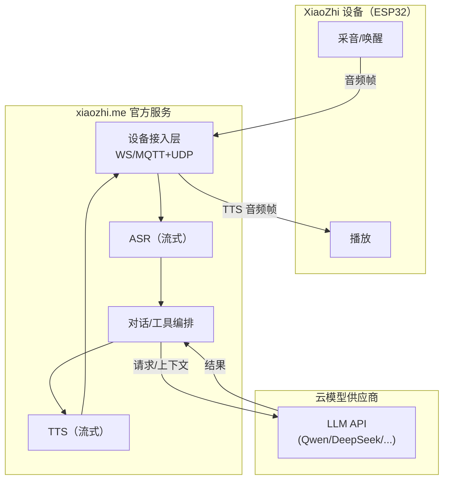
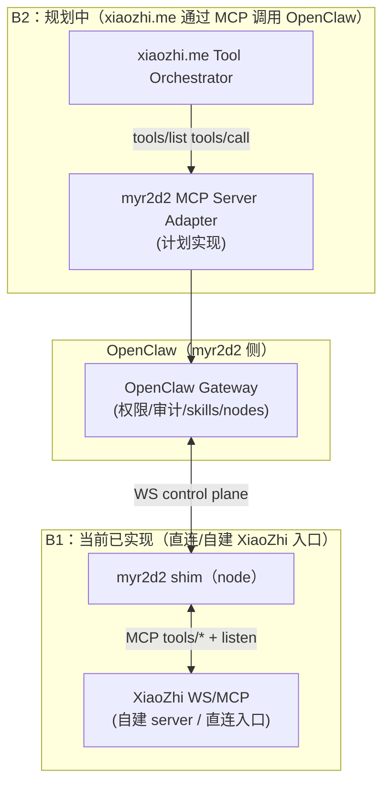
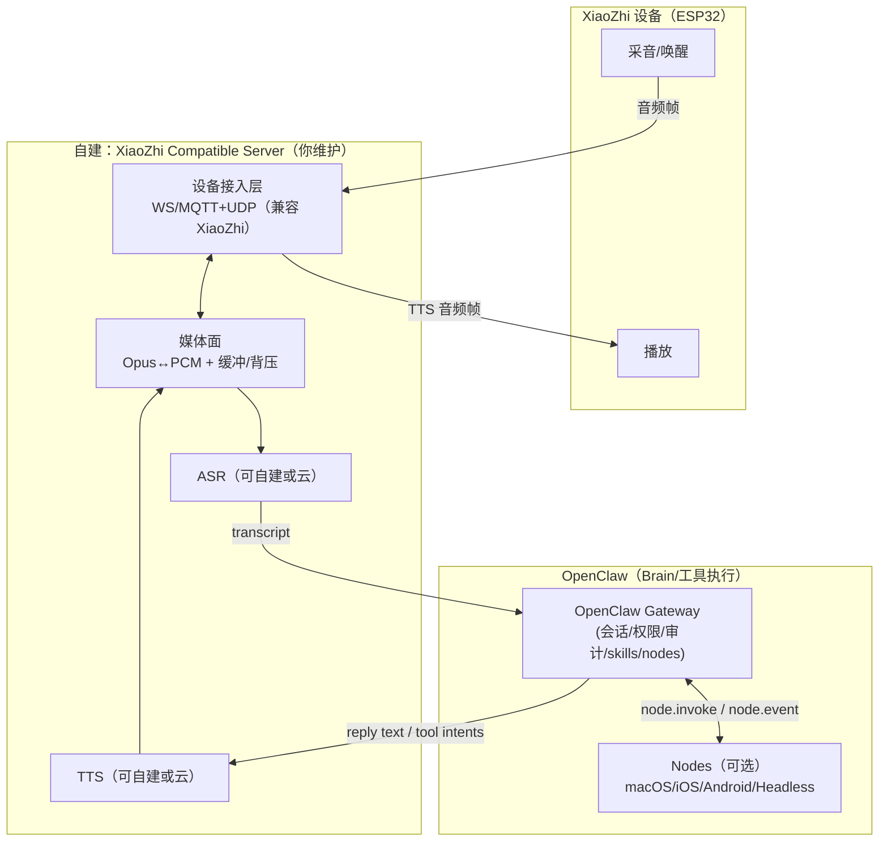
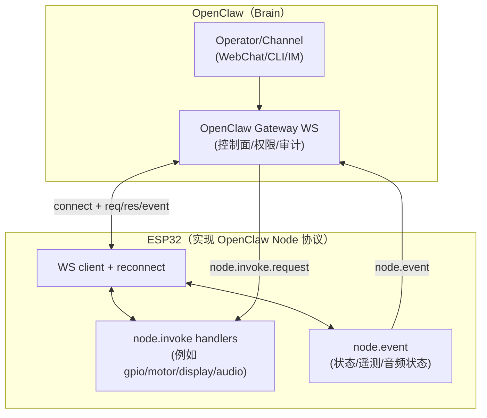

# myr2d2：XiaoZhi × OpenClaw 互联桥接

本仓库的目标是把 **XiaoZhi（ESP32 语音入口）** 与 **OpenClaw（可审计的工具执行/多端节点/权限控制的大脑）** 连起来，形成“语音入口 → 工具执行 → 结果回传”的闭环。

当前仓库内已有两类组件：
- **shim（Node）**：把 XiaoZhi 的 MCP/WebSocket 适配为 OpenClaw 的 node.invoke（见 [`/src/bridge/shim.ts`](file:///Users/litianyi/Documents/__secondlife/__project/myr2d2/src/bridge/shim.ts)）
- **xiaozhi compatible server（最小原型）**：用于在本地替代 `xiaozhi.me` 做联调（见 [`/src/xiaozhi-server/server.ts`](file:///Users/litianyi/Documents/__secondlife/__project/myr2d2/src/xiaozhi-server/server.ts)）

更完整的架构/去云设计见：
- 官方默认数据流架构图：[`doc/plans/2026-02-09-xiaozhi-official-architecture.md`](file:///Users/litianyi/Documents/__secondlife/__project/myr2d2/doc/plans/2026-02-09-xiaozhi-official-architecture.md)
- 去除官方云设计：[`doc/plans/2026-02-09-decloud-xiaozhi-design.md`](file:///Users/litianyi/Documents/__secondlife/__project/myr2d2/doc/plans/2026-02-09-decloud-xiaozhi-design.md)

## 快速开始（本地可跑、无硬件）

前置：
- Node.js ≥ 22（OpenClaw 也要求 Node≥22）

### 1) 构建与跑测试（自检）

在仓库的 `src/` 目录：

```bash
npm install
npm run build
npm test
```

该测试使用 Mock OpenClaw Gateway + Mock XiaoZhi Server 验证桥接闭环（见 [`/src/tests/shim.e2e.test.ts`](file:///Users/litianyi/Documents/__secondlife/__project/myr2d2/src/tests/shim.e2e.test.ts)）。

### 2) 启动本地 XiaoZhi Compatible Server（替代 xiaozhi.me）

```bash
cd src
npm run build
MYR2D2_XIAOZHI_SERVER_PORT=18080 npm run xiaozhi:server
```

这会在 `ws://127.0.0.1:18080` 启动一个最小 WebSocket server，支持：
- `hello`
- `listen start/stop`（会回 mock 的 `stt/llm/tts` 状态）
- `mcp`（支持 `initialize`、`tools/list`、`tools/call` 的最小返回）

## 真实互联（OpenClaw Gateway ↔ myr2d2 shim ↔ XiaoZhi）

这一节描述“把 myr2d2 shim 当作 OpenClaw 的 node”来接入 Gateway，然后由 operator 调用 node.invoke。

### 1) 启动 OpenClaw Gateway

安装并启动（示例）：

```bash
npm install -g openclaw@latest
openclaw onboard --install-daemon
openclaw gateway --port 18789
```

如果 Gateway 需要对非回环地址暴露，建议显式指定 token（OpenClaw 文档说明非回环 bind 必须 token）：  
见 OpenClaw 文档：[gateway/network-model.md](file:///Users/litianyi/Documents/__secondlife/__project/myr2d2/thirdparty/myopenclaw/docs/gateway/network-model.md)

### 2) 启动 myr2d2 shim（作为 OpenClaw node）

在本仓库 `src/` 目录：

```bash
cd src
npm install
npm run build

MYR2D2_GATEWAY_URL="ws://127.0.0.1:18789" \
MYR2D2_GATEWAY_TOKEN="<your-token>" \
MYR2D2_NODE_ID="myr2d2.xiaozhi" \
MYR2D2_XIAOZHI_WS_URL="ws://127.0.0.1:18080" \
MYR2D2_DECLARED_COMMANDS="mcp.initialize,mcp.tools.list,mcp.tools.call,edge.audio.stream.start,edge.audio.stream.stop" \
npm start
```

说明：
- `MYR2D2_XIAOZHI_WS_URL` 可以指向你的真实 XiaoZhi 入口（自建 server / 设备侧 ws 入口），也可以先指向上面的本地兼容 server。
- 你也可以用 `MYR2D2_GATEWAY_PASSWORD` 替代 token（取决于 Gateway 配置）。

### 3) 验证 node 已连接

在运行 Gateway 的主机上：

```bash
openclaw nodes status
openclaw nodes list --connected
```

如遇到“pending/需要 approve”的情况（更严格的配对模式下常见）：

```bash
openclaw nodes pending
openclaw nodes approve <requestId>
```

### 4) 通过 OpenClaw 调用（node.invoke）

列出 MCP 工具：

```bash
openclaw nodes invoke --node "myr2d2.xiaozhi" --command "mcp.tools.list" --params "{}"
```

调用 MCP 工具（示例）：

```bash
openclaw nodes invoke --node "myr2d2.xiaozhi" --command "mcp.tools.call" \
  --params '{"name":"self.get_device_status","arguments":{}}'
```

控制音频流开关（先验收“控制 + session_id 绑定”，不要求真实音频质量）：

```bash
openclaw nodes invoke --node "myr2d2.xiaozhi" --command "edge.audio.stream.start" --params "{}"
openclaw nodes invoke --node "myr2d2.xiaozhi" --command "edge.audio.stream.stop" --params "{}"
```

## 路线 B（推荐“最终形态”）：ESP32 做唤醒，OpenClaw 做其余（Phase-1：Mock 数据面）

路线 B 的核心是：ESP32 直接作为 OpenClaw node 连接 Gateway（控制面），同时通过 Audio Plane（数据面）上传/接收音频流。\n当前仓库提供 Phase-1 的 Mock 版本用于冻结协议与验收链路（无需写固件即可联调）。

### 1) 启动 OpenClaw Gateway

```bash
openclaw gateway --port 18789
```

如需对非回环暴露，请按 OpenClaw 文档配置 token：见 [gateway/network-model.md](file:///Users/litianyi/Documents/__secondlife/__project/myr2d2/thirdparty/myopenclaw/docs/gateway/network-model.md)

### 2) 启动 Audio Plane（Mock ASR/TTS）

在本仓库 `src/` 目录：

```bash
cd src
npm install
npm run build

MYR2D2_AUDIO_PLANE_PORT=18880 \
MYR2D2_AUDIO_PLANE_MOCK_TRANSCRIPT="你好" \
MYR2D2_AUDIO_PLANE_MOCK_TTS="收到" \
npm run audio:plane
```

### 3) 启动 ESP32 Node 模拟器（冻结命令协议）

新开一个终端（仍在 `src/`）：

```bash
MYR2D2_GATEWAY_URL="ws://127.0.0.1:18789" \
MYR2D2_NODE_ID="myr2d2.esp32" \
MYR2D2_AUDIO_PLANE_BASE_URL="ws://127.0.0.1:18880" \
MYR2D2_DECLARED_COMMANDS="audio.stream.start,audio.stream.stop,audio.play.start,audio.play.stop,device.wake.mock" \
npm run routeb:node
```

### 4) 用 OpenClaw 触发一次会话（控制面验收）

```bash
openclaw nodes list --connected
openclaw nodes invoke --node "myr2d2.esp32" --command "device.wake.mock" --params "{}"
openclaw nodes invoke --node "myr2d2.esp32" --command "audio.stream.start" --params '{"codec":"opus","sampleRate":16000,"channels":1}'
```

说明：
- `audio.stream.start` 会返回 `session_id/uplink_url/downlink_url/token`。\n- Phase-1 里 Audio Plane 会在收到 uplink 的首个二进制帧后，向 downlink 广播 mock 的 `asr.mock/tts.mock`（以及一段 mock 二进制音频）。\n- 真实固件实现时：ESP32 在本地唤醒后连接 uplink 并推送音频帧，同时连接 downlink 播放 TTS 音频。

## 当前 dataflow（xiaozhi.me / XiaoZhi / OpenClaw / 云模型）

为了避免把“官方默认”和“本仓库当前实现/规划”混在一起，这里给出四张图：
- **图 A：官方默认（设备 ↔ xiaozhi.me ↔ 云模型）**：这条链路不依赖 OpenClaw。
- **图 B：接入 OpenClaw 的两种方式**：\n  - **B1（当前仓库已实现）**：OpenClaw ↔ myr2d2 shim ↔（自建/直连的）XiaoZhi WebSocket/MCP\n  - **B2（规划中）**：xiaozhi.me 通过 MCP 调用 OpenClaw（需要额外实现 MCP Server Adapter）
- **图 C：路线 A（去云）**：设备仍跑 XiaoZhi 协议，但把 `xiaozhi.me` 换成你自建的 XiaoZhi Compatible Server；OpenClaw 作为 Brain/工具执行层。
- **图 D：路线 B（更彻底）**：设备不再跑 XiaoZhi 协议，直接实现 OpenClaw Gateway WS，成为一个 OpenClaw node。

### 图 A：官方默认（设备 ↔ xiaozhi.me ↔ 云模型）



### 图 B：接入 OpenClaw 的两种方式



### 图 C：路线 A（去云）：自建 XiaoZhi Compatible Server + OpenClaw Brain



### 图 D：路线 B：ESP32 直接作为 OpenClaw node（直连 Gateway WS）



备注：
- 你要“去除 xiaozhi.me”，建议走 B1 并逐步把 `XLocal` 演进为“XiaoZhi Compatible Server + 真实音频媒体面”；设计细节见 [`doc/plans/2026-02-09-decloud-xiaozhi-design.md`](file:///Users/litianyi/Documents/__secondlife/__project/myr2d2/doc/plans/2026-02-09-decloud-xiaozhi-design.md)。
