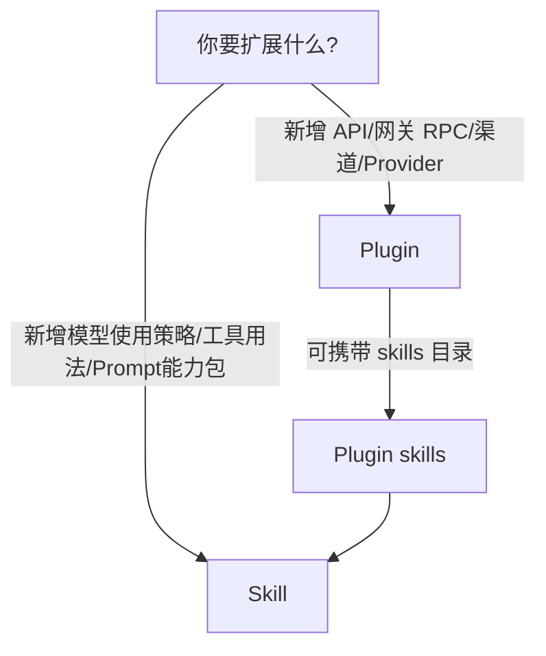

# OpenClaw Plugins & Skills（一页摘要）

适用读者：平台负责人/架构/工程经理，希望快速知道“怎么扩展、扩展到哪一层、风险边界在哪”。

## TL;DR

- Plugins 是“系统级扩展”：进程内加载，可注册 gateway methods / HTTP routes / channels / providers / hooks。证据：[registry.ts:L265-L285](file:///Users/litianyi/Documents/__secondlife/__project/myr2d2/thirdparty/myopenclaw/src/plugins/registry.ts#L265-L285)
- Skills 是“认知级扩展”：以 `SKILL.md` + frontmatter metadata 为载体，多来源覆盖栈，按可用性筛选后注入 prompt。证据：[workspace.ts:L123-L170](file:///Users/litianyi/Documents/__secondlife/__project/myr2d2/thirdparty/myopenclaw/src/agents/skills/workspace.ts#L123-L170)、[workspace.ts:L204-L214](file:///Users/litianyi/Documents/__secondlife/__project/myr2d2/thirdparty/myopenclaw/src/agents/skills/workspace.ts#L204-L214)
- 插件加载是 schema-first：缺 `configSchema` 直接 fail-fast，减少运行期事故。证据：[loader.ts:L280-L292](file:///Users/litianyi/Documents/__secondlife/__project/myr2d2/thirdparty/myopenclaw/src/plugins/loader.ts#L280-L292)

## 分层：什么时候用 Plugin，什么时候用 Skill

## Plugins：发现与加载的关键点（为什么能长期维护）

- 多来源发现（workspace/global/bundled/config），支持 JS/TS 文件与 package.json 的 `openclaw.extensions`。证据：[discovery.ts:L12-L38](file:///Users/litianyi/Documents/__secondlife/__project/myr2d2/thirdparty/myopenclaw/src/plugins/discovery.ts#L12-L38)、[discovery.ts:L53-L59](file:///Users/litianyi/Documents/__secondlife/__project/myr2d2/thirdparty/myopenclaw/src/plugins/discovery.ts#L53-L59)
- 同 id 覆盖冲突会被标记 disabled（避免“双生插件”导致非确定性）。证据：[loader.ts:L225-L253](file:///Users/litianyi/Documents/__secondlife/__project/myr2d2/thirdparty/myopenclaw/src/plugins/loader.ts#L225-L253)
- gatewayMethods 注册禁止覆盖 core 或其他插件已注册方法（防止 API 劫持/冲突）。证据：[registry.ts:L274-L285](file:///Users/litianyi/Documents/__secondlife/__project/myr2d2/thirdparty/myopenclaw/src/plugins/registry.ts#L274-L285)

## Skills：覆盖栈与可用性筛选（为什么“可控注入”）

- 来源优先级：extra < bundled < managed < workspace（项目级可覆盖平台默认）。证据：[workspace.ts:L158-L170](file:///Users/litianyi/Documents/__secondlife/__project/myr2d2/thirdparty/myopenclaw/src/agents/skills/workspace.ts#L158-L170)
- 注入前过滤：不满足依赖/策略的技能不会进入 prompt（减少模型幻觉）。证据：[workspace.ts:L204-L214](file:///Users/litianyi/Documents/__secondlife/__project/myr2d2/thirdparty/myopenclaw/src/agents/skills/workspace.ts#L204-L214)
- 插件携带技能目录会被并入 skills 搜索路径（装了插件就带上“使用说明与策略”）。证据：[workspace.ts:L130-L135](file:///Users/litianyi/Documents/__secondlife/__project/myr2d2/thirdparty/myopenclaw/src/agents/skills/workspace.ts#L130-L135)

## 对 myr2d2 的直接建议

- 用 Plugin 扩展“控制面能力”：例如新增 `gatewayMethods` 来暴露机器人特定 RPC、或接入新 channel/provider。\n- 用 Skills 扩展“行为与策略”：例如“底盘移动安全规则”“摄像头采集合规”“家庭偏好与禁区”等。\n- 对外设/端侧能力（XiaoZhi/手机/桌面）尽量走 node.invoke 总线；Plugin 仅负责把能力纳入统一入口与权限模型（不要把业务逻辑散在多处）。

## 风险与对策（P0/P1）

- P0：插件是进程内执行，属于高信任边界 → 必须启用 allow/deny 管控，并配合安全审计深扫（deep audit）。证据（审计入口）：[audit-extra.ts](file:///Users/litianyi/Documents/__secondlife/__project/myr2d2/thirdparty/myopenclaw/src/security/audit-extra.ts)\n- P1：技能安装可能引入外部依赖 → 依赖安装前做扫描并限制在 sandbox/allowlist 工具面内运行。证据（扫描器）：[skill-scanner.ts](file:///Users/litianyi/Documents/__secondlife/__project/myr2d2/thirdparty/myopenclaw/src/security/skill-scanner.ts)

## 延伸阅读

- 深挖版：[plugins-and-skills.md](file:///Users/litianyi/Documents/__secondlife/__project/myr2d2/doc/openclaw/deepdives/plugins-and-skills.md)

