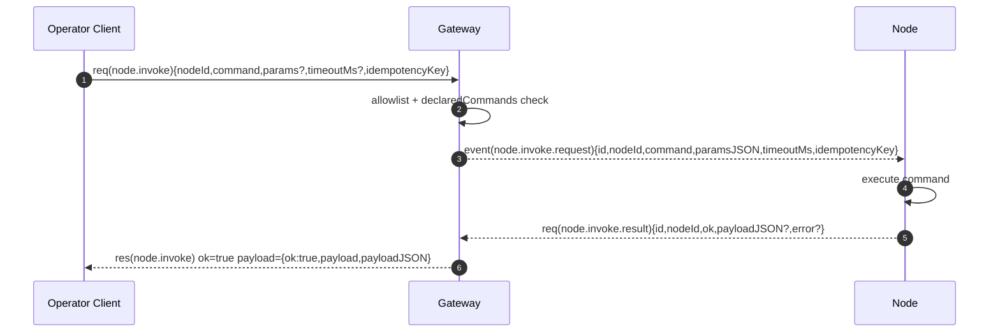

# Node 接入契约（pairing、invoke、platform allowlist）

ROOT：`/Users/litianyi/Documents/__secondlife/__project/myr2d2/thirdparty/myopenclaw`

## 1) 两套配对：device pairing vs node pairing

### device pairing（设备身份/operator 侧）

- 设备身份以 `deviceId + publicKey` 为核心，并可下发 device token（带 `role/scopes`）。证据：[device-pairing.ts:L23-L31](file:///Users/litianyi/Documents/__secondlife/__project/myr2d2/thirdparty/myopenclaw/src/infra/device-pairing.ts#L23-L31)
- 配对存储位置：`$STATE_DIR/devices/{pending.json,paired.json}`。证据：[device-pairing.ts:L70-L78](file:///Users/litianyi/Documents/__secondlife/__project/myr2d2/thirdparty/myopenclaw/src/infra/device-pairing.ts#L70-L78)

### node pairing（节点身份/端侧能力侧）

- 节点配对产物包含 `nodeId/token`，并记录端侧声明的能力（caps/commands/permissions）。证据：[node-pairing.ts:L25-L43](file:///Users/litianyi/Documents/__secondlife/__project/myr2d2/thirdparty/myopenclaw/src/infra/node-pairing.ts#L25-L43)
- 配对存储位置：`$STATE_DIR/nodes/{pending.json,paired.json}`。证据：[node-pairing.ts:L57-L65](file:///Users/litianyi/Documents/__secondlife/__project/myr2d2/thirdparty/myopenclaw/src/infra/node-pairing.ts#L57-L65)
- token 生成方式：UUID 去掉 `-`。证据：[node-pairing.ts:L146-L148](file:///Users/litianyi/Documents/__secondlife/__project/myr2d2/thirdparty/myopenclaw/src/infra/node-pairing.ts#L146-L148)

## 2) 节点在线会话（NodeSession）：端侧连接时上报的能力

网关在 node 连接后会把 connect 中的能力字段固化为 `NodeSession`：\n- `caps/commands/permissions/pathEnv` 来自 connect；`nodeId` 默认取 `connect.device.id`，否则退回到 `connect.client.id`。\n证据：[node-registry.ts:L43-L76](file:///Users/litianyi/Documents/__secondlife/__project/myr2d2/thirdparty/myopenclaw/src/gateway/node-registry.ts#L43-L76)

## 3) node.invoke：调用链、授权与超时语义

### 3.1 RPC：node.invoke（operator → gateway）

`node.invoke` 的关键步骤：
- 必须 node 在线，否则返回 `NOT_CONNECTED`。证据：[nodes.ts:L391-L401](file:///Users/litianyi/Documents/__secondlife/__project/myr2d2/thirdparty/myopenclaw/src/gateway/server-methods/nodes.ts#L391-L401)
- 二次授权：\n  - allowlist：按 platform 的默认命令集合 + config allowCommands/denyCommands\n  - declared commands：必须在 node 自声明的 commands 中\n 证据：[nodes.ts:L403-L418](file:///Users/litianyi/Documents/__secondlife/__project/myr2d2/thirdparty/myopenclaw/src/gateway/server-methods/nodes.ts#L403-L418)、[node-command-policy.ts:L99-L137](file:///Users/litianyi/Documents/__secondlife/__project/myr2d2/thirdparty/myopenclaw/src/gateway/node-command-policy.ts#L99-L137)
- 下发：调用 `context.nodeRegistry.invoke()`，由 registry 发 `node.invoke.request` 事件并等待回包。证据：[nodes.ts:L420-L426](file:///Users/litianyi/Documents/__secondlife/__project/myr2d2/thirdparty/myopenclaw/src/gateway/server-methods/nodes.ts#L420-L426)、[node-registry.ts:L121-L155](file:///Users/litianyi/Documents/__secondlife/__project/myr2d2/thirdparty/myopenclaw/src/gateway/node-registry.ts#L121-L155)

### 3.2 事件：node.invoke.request（gateway → node）

payload 结构（实现层）：\n- `id`：requestId\n- `nodeId/command`\n- `paramsJSON`：params 的 JSON 字符串（允许 null）\n- `timeoutMs/idempotencyKey`\n证据：[node-registry.ts:L121-L131](file:///Users/litianyi/Documents/__secondlife/__project/myr2d2/thirdparty/myopenclaw/src/gateway/node-registry.ts#L121-L131)

### 3.3 RPC：node.invoke.result（node → gateway）

回包规则：
- gateway 会校验 callerNodeId 与 payload nodeId 一致（防止 node 伪造他人结果）。证据：[nodes.ts:L469-L473](file:///Users/litianyi/Documents/__secondlife/__project/myr2d2/thirdparty/myopenclaw/src/gateway/server-methods/nodes.ts#L469-L473)
- 超时后的迟到回包会被忽略，且返回 `{ok:true, ignored:true}` 以降低噪音。证据：[nodes.ts:L482-L488](file:///Users/litianyi/Documents/__secondlife/__project/myr2d2/thirdparty/myopenclaw/src/gateway/server-methods/nodes.ts#L482-L488)

### 3.4 超时与断连语义（registry）

- 默认超时：30s（可通过 `timeoutMs` 覆盖）。证据：[node-registry.ts:L138-L146](file:///Users/litianyi/Documents/__secondlife/__project/myr2d2/thirdparty/myopenclaw/src/gateway/node-registry.ts#L138-L146)\n- node 断开时：registry 会 reject 所有该 node 的 pending invokes。证据：[node-registry.ts:L81-L95](file:///Users/litianyi/Documents/__secondlife/__project/myr2d2/thirdparty/myopenclaw/src/gateway/node-registry.ts#L81-L95)

## 4) platform allowlist（端侧命令默认集）

openclaw 对不同平台有默认 allowlist（例如 iOS/Android 的 camera/screen/location，macOS 额外允许 system/browser.proxy）：\n证据：[node-command-policy.ts:L32-L58](file:///Users/litianyi/Documents/__secondlife/__project/myr2d2/thirdparty/myopenclaw/src/gateway/node-command-policy.ts#L32-L58)

平台归一化：`darwin -> macos`，也可用 `deviceFamily` 兜底推断。证据：[node-command-policy.ts:L60-L97](file:///Users/litianyi/Documents/__secondlife/__project/myr2d2/thirdparty/myopenclaw/src/gateway/node-command-policy.ts#L60-L97)

