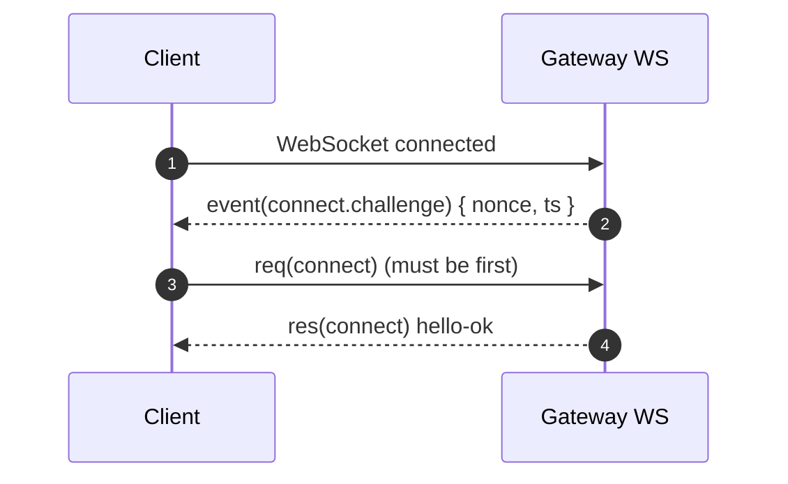

# Gateway WS Events（openclaw 参考契约）

ROOT：`/Users/litianyi/Documents/__secondlife/__project/myr2d2/thirdparty/myopenclaw`

## 事件名清单（公开枚举）

服务端导出事件名列表： [server-methods-list.ts:L95-L114](file:///Users/litianyi/Documents/__secondlife/__project/myr2d2/thirdparty/myopenclaw/src/gateway/server-methods-list.ts#L95-L114)
- `connect.challenge`
- `agent`
- `chat`
- `presence`
- `tick`
- `talk.mode`
- `shutdown`
- `health`
- `heartbeat`
- `cron`
- `node.pair.requested`
- `node.pair.resolved`
- `node.invoke.request`
- `device.pair.requested`
- `device.pair.resolved`
- `voicewake.changed`
- `exec.approval.requested`
- `exec.approval.resolved`

## Event frame 语义（seq、stateVersion、定向事件）

事件的 wire 形状： [frames.ts:L147-L156](file:///Users/litianyi/Documents/__secondlife/__project/myr2d2/thirdparty/myopenclaw/src/gateway/protocol/schema/frames.ts#L147-L156)
- `seq`：可选序号，用于检测事件丢失/乱序。
- `stateVersion`：可选 `{presence,health}` 版本号，用于客户端识别“状态型事件”的新旧。

服务端广播实现细节：
- 非定向广播会自增 `seq`；定向发送（broadcastToConnIds）不附带 `seq`。证据：[server-broadcast.ts:L34-L54](file:///Users/litianyi/Documents/__secondlife/__project/myr2d2/thirdparty/myopenclaw/src/gateway/server-broadcast.ts#L34-L54)
- 事件可附带 `dropIfSlow`，当消费者过慢时可丢弃（或直接 close 连接）。证据：[server-broadcast.ts:L75-L86](file:///Users/litianyi/Documents/__secondlife/__project/myr2d2/thirdparty/myopenclaw/src/gateway/server-broadcast.ts#L75-L86)

## Scope gating（哪些事件需要额外 scopes）

部分事件只对具备对应 scopes 的 operator 可见： [server-broadcast.ts:L9-L16](file:///Users/litianyi/Documents/__secondlife/__project/myr2d2/thirdparty/myopenclaw/src/gateway/server-broadcast.ts#L9-L16)
- `exec.approval.requested/resolved` → `operator.approvals`
- `node.pair.*` / `device.pair.*` → `operator.pairing`

具体检查逻辑：
- role 不是 operator 时直接拒绝（除 admin 特殊放行）。证据：[server-broadcast.ts:L18-L32](file:///Users/litianyi/Documents/__secondlife/__project/myr2d2/thirdparty/myopenclaw/src/gateway/server-broadcast.ts#L18-L32)

## 两条关键时序（connect.challenge 与 node.invoke.request）

### connect.challenge

服务端在连接建立后立即发送 `connect.challenge`： [ws-connection.ts:L120-L125](file:///Users/litianyi/Documents/__secondlife/__project/myr2d2/thirdparty/myopenclaw/src/gateway/server/ws-connection.ts#L120-L125)

### node.invoke.request（网关下发到节点）

节点断开时，网关会注销 node 会话并清理订阅： [ws-connection.ts:L197-L203](file:///Users/litianyi/Documents/__secondlife/__project/myr2d2/thirdparty/myopenclaw/src/gateway/server/ws-connection.ts#L197-L203)

`node.invoke` 请求会被实现为向 node 连接发事件 `node.invoke.request`，并由 registry 等待回包（详见 node-contract 文档）。

