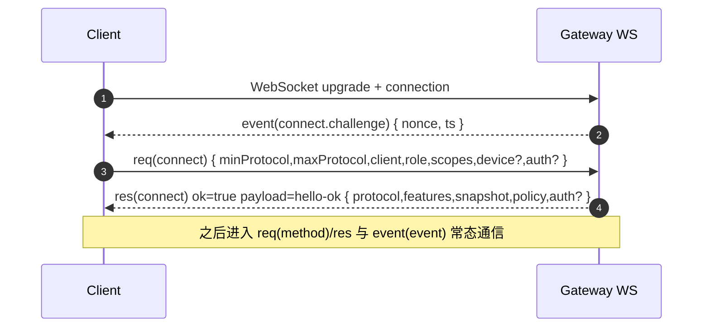

# Gateway WS Frames（openclaw 参考契约）

ROOT：`/Users/litianyi/Documents/__secondlife/__project/myr2d2/thirdparty/myopenclaw`

## Frame 类型（wire 格式）

- `req`：请求帧（`id/method/params?`）。证据：[frames.ts:L126-L134](file:///Users/litianyi/Documents/__secondlife/__project/myr2d2/thirdparty/myopenclaw/src/gateway/protocol/schema/frames.ts#L126-L134)
- `res`：响应帧（`id/ok/payload?/error?`）。证据：[frames.ts:L136-L145](file:///Users/litianyi/Documents/__secondlife/__project/myr2d2/thirdparty/myopenclaw/src/gateway/protocol/schema/frames.ts#L136-L145)
- `event`：事件帧（`event/payload?/seq?/stateVersion?`）。证据：[frames.ts:L147-L156](file:///Users/litianyi/Documents/__secondlife/__project/myr2d2/thirdparty/myopenclaw/src/gateway/protocol/schema/frames.ts#L147-L156)
- 顶层判别：`GatewayFrameSchema` 是以上三类的 discriminated union（`discriminator: "type"`）。证据：[frames.ts:L158-L164](file:///Users/litianyi/Documents/__secondlife/__project/myr2d2/thirdparty/myopenclaw/src/gateway/protocol/schema/frames.ts#L158-L164)

## Connect 握手（时序）

握手的关键点：服务端在 WS connection 之后会先发 `connect.challenge`（nonce + ts），客户端必须用该 nonce 构造 `connect` 的签名/认证并作为首个 `req` 发送。

证据：
- server 在连接建立后立即发送 `connect.challenge`：[ws-connection.ts:L120-L125](file:///Users/litianyi/Documents/__secondlife/__project/myr2d2/thirdparty/myopenclaw/src/gateway/server/ws-connection.ts#L120-L125)
- `connect` params schema：[frames.ts:L20-L68](file:///Users/litianyi/Documents/__secondlife/__project/myr2d2/thirdparty/myopenclaw/src/gateway/protocol/schema/frames.ts#L20-L68)
- `hello-ok` schema（作为 connect 成功的 payload）：[frames.ts:L70-L113](file:///Users/litianyi/Documents/__secondlife/__project/myr2d2/thirdparty/myopenclaw/src/gateway/protocol/schema/frames.ts#L70-L113)
- 服务端强制第一条必须是 `connect`： [message-handler.ts:L263-L305](file:///Users/litianyi/Documents/__secondlife/__project/myr2d2/thirdparty/myopenclaw/src/gateway/server/ws-connection/message-handler.ts#L263-L305)

## ConnectParams（客户端提交的身份/能力/认证）

字段语义（按 schema）：[frames.ts:L20-L68](file:///Users/litianyi/Documents/__secondlife/__project/myr2d2/thirdparty/myopenclaw/src/gateway/protocol/schema/frames.ts#L20-L68)
- 协议协商：`minProtocol/maxProtocol`（整数）用于与服务端协议版本做交集选择。
- 客户端标识：`client.id/version/platform/mode` 等（服务端可用于策略、allowlist、UI 展示）。
- 能力上报（可选）：`caps/commands/permissions/pathEnv` 用于 node/端侧模式的能力声明与后续 allowlist 过滤。
- 角色/权限：`role/scopes`（可选）用于服务端鉴权授权（operator/node）。
- 设备身份（可选）：`device.{id,publicKey,signature,signedAt,nonce?}` 用于设备签名登录与配对。
- 共享密钥（可选）：`auth.{token,password}` 用于 token/password 认证。

## HelloOk（服务端确认连接后返回的能力与策略）

结构： [frames.ts:L70-L113](file:///Users/litianyi/Documents/__secondlife/__project/myr2d2/thirdparty/myopenclaw/src/gateway/protocol/schema/frames.ts#L70-L113)
- `features.methods/events`：服务端允许该连接使用的 methods 与会接收的 events。
- `snapshot`：连接时的状态快照（presence/health/config 相关等）。
- `policy`：`maxPayload/maxBufferedBytes/tickIntervalMs` 为服务端对通信与心跳的约束参数。
- `auth.deviceToken`（可选）：服务端可下发 device token（包含 `role/scopes`），供后续 device-token 登录复用。

## Validation（AJV 编译的运行时校验点）

openclaw 在协议层提供 AJV 校验器（服务端与客户端均可复用），例如：
- `validateConnectParams/validateRequestFrame/validateResponseFrame/validateEventFrame`。证据：[protocol/index.ts:L211-L221](file:///Users/litianyi/Documents/__secondlife/__project/myr2d2/thirdparty/myopenclaw/src/gateway/protocol/index.ts#L211-L221)

