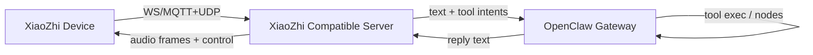

# 去除 XiaoZhi 官方云：用 OpenClaw 作为自定义 Server/Brain 的设计

日期：2026-02-09  
目标：回答“能否去除 xiaozhi 官方服务、以及能否认为 openclaw 就是自定义 server”。

## 0. 结论（一句话）
OpenClaw **可以成为自定义 server 的 Brain/控制面**，但它**不是** XiaoZhi 官方云的“协议级同构替代品”；要真正去云，你仍需实现一个“XiaoZhi Compatible Server”（设备接入与音频流），或者重写固件让设备直接成为 OpenClaw node。

## 1) 能力对照：为什么你会觉得“相当”

### 1.1 重叠部分（确实相当）
- **LLM/对话编排**：两者都能做“把输入变成回复/动作”的 agent 编排。
- **工具系统**：\n  - XiaoZhi：通过 MCP tools/list/tools/call 扩展能力。证据：[mcp-protocol.md](file:///Users/litianyi/Documents/__secondlife/__project/myr2d2/thirdparty/my-xiaozhi-esp32/docs/mcp-protocol.md)\n  - OpenClaw：通过 gateway + skills + nodes 做可审计的工具执行与权限控制。
- **语音能力（部分）**：OpenClaw 支持 TTS（多 provider）。证据：[tts.md](file:///Users/litianyi/Documents/__secondlife/__project/myr2d2/thirdparty/myopenclaw/docs/tts.md)\n  也支持“音频转录”能力（但主要针对语音消息/附件，而非 MCU 语音流的实时双向媒体面）。证据：[nodes/audio.md](file:///Users/litianyi/Documents/__secondlife/__project/myr2d2/thirdparty/myopenclaw/docs/zh-CN/nodes/audio.md)

### 1.2 不重叠部分（导致不能“直接替换”）
- **设备接入协议栈**：XiaoZhi 设备端使用 WebSocket 或 MQTT+UDP 的特定 hello/控制/二进制音频帧协议。证据：[websocket.md](file:///Users/litianyi/Documents/__secondlife/__project/myr2d2/thirdparty/my-xiaozhi-esp32/docs/websocket.md)、[mqtt-udp.md](file:///Users/litianyi/Documents/__secondlife/__project/myr2d2/thirdparty/my-xiaozhi-esp32/docs/mqtt-udp.md)\n  OpenClaw 并不原生实现这些协议。\n- **音频媒体面**：XiaoZhi 云承担“流式 ASR/LLM/TTS + 音频回传”的媒体管线；OpenClaw 的 TTS/转录更偏“消息/附件”与桌面/移动端语音交互（Talk mode）。证据：[talk.md](file:///Users/litianyi/Documents/__secondlife/__project/myr2d2/thirdparty/myopenclaw/docs/nodes/talk.md)\n- **会话/鉴权的语义**：XiaoZhi 的 Authorization/Device-Id 等 header、session_id 绑定，与 OpenClaw 的 device identity + pairing/token 体系不同。

## 2) 去云两条路线（A 推荐，B 更彻底但更重）

## 2.1 路线 A（推荐）：保留 XiaoZhi 设备协议 → 自建 XiaoZhi Compatible Server → OpenClaw 做 Brain

### 2.1.1 组件边界

### 2.1.2 这个“自建 server”最少要做什么
最小可运行子集（MVP）建议分 3 个迭代层级：
- **MVP-0（只验证协议接入）**：\n  - 接受设备 WebSocket 连接\n  - 解析/回应 `hello`\n  - 支持 `listen start/stop` 控制\n  - 不做真实 ASR/TTS，只回 mock `stt/tts` JSON 消息证明链路可跑
- **MVP-1（文本闭环）**：\n  - 把“模拟的 transcript”送给 OpenClaw（作为 operator 输入）\n  - 拿到 OpenClaw 的回复文本\n  - 以 JSON 的 `llm/tts` 文本消息回给设备（不回音频）
- **MVP-2（语音闭环）**：\n  - 设备上行音频帧（Opus）→ 解码为 PCM\n  - ASR（可先用本地 Whisper/云 STT）\n  - OpenClaw 回复文本 → TTS 合成（OpenClaw 自带 provider）\n  - 若设备只接受 Opus：将 PCM 编码为 Opus 并以二进制帧下发\n\n说明：MVP-2 才是真正意义上的“去云语音体验”；MVP-0/1 主要用来快速验证系统集成边界与控制协议。

### 2.1.3 OpenClaw 在路线 A 中扮演什么
- Brain：会话、工具编排、权限审计、node.invoke 调用节点能力。\n- 语音：可提供 TTS（强），STT（对“流式实时”需要二次工程）。证据：[tts.md](file:///Users/litianyi/Documents/__secondlife/__project/myr2d2/thirdparty/myopenclaw/docs/tts.md)、[nodes/audio.md](file:///Users/litianyi/Documents/__secondlife/__project/myr2d2/thirdparty/myopenclaw/docs/zh-CN/nodes/audio.md)
- 对接点（建议）：\n  - 自建 server 把 transcript 当作“一个 channel 输入”，喂给 OpenClaw session\n  - OpenClaw 的工具执行与 node.invoke 作为“动作执行层”统一管理

## 2.2 路线 B：设备成为 OpenClaw Node（设备直连 Gateway WS）

### 2.2.1 思路
重写/改造 ESP32 固件，让它实现 OpenClaw Gateway WS 协议（connect/req/res/event），并以 node 身份接入，直接处理 `node.invoke.request`，回 `node.invoke.result`，并主动上报 `node.event`。

### 2.2.2 需要实现的协议子集（最小）
- WebSocket client + reconnect\n- OpenClaw handshake：`connect` 请求（协议版本协商、role=node、commands 上报、auth token/password）\n- 事件处理：`node.invoke.request`\n- 回包：`node.invoke.result`\n- 主动事件：`node.event`（用于状态、音频流状态等）\n\n这套合约定义见：\n- Gateway 顶层帧：Request/Response/Event。证据：[frames.ts](file:///Users/litianyi/Documents/__secondlife/__project/myr2d2/thirdparty/myopenclaw/src/gateway/protocol/schema/frames.ts)\n- Node invoke 合约。证据：[nodes.ts](file:///Users/litianyi/Documents/__secondlife/__project/myr2d2/thirdparty/myopenclaw/src/gateway/protocol/schema/nodes.ts)

### 2.2.3 工作量评估（相对路线 A）
- 优点：控制面完全统一，OpenClaw 的权限/审计/节点管理可以直接复用。\n- 难点：\n  - ESP32 上实现完整且稳定的 WS 客户端状态机\n  - 安全接入（device identity/pairing/token）与密钥存储\n  - 音频管线如何抽象成 node 命令（尤其是实时 streaming）\n- 结论：B 是“架构上最干净”的终局，但不适合作为第一条落地路径。

更细的子任务拆分（用于评估与排期）：
- **协议与连接（S）**：WS client、重连、心跳、消息队列、最大帧与背压策略
- **Handshake（S）**：connect 帧、protocol 协商、role=node、declaredCommands/caps 上报
- **认证与配对（M）**：\n  - 最小实现：共享密钥 token/password（可行但不够“设备级安全”）\n  - 完整实现：device identity 签名 + pairing/token 生命周期管理（密钥存储、轮换、撤销）
- **命令分层（M）**：将端侧能力设计成稳定的 node commands（如 audio.listen.start/stop、io.gpio.set、motor.set、display.render 等）
- **媒体面（L）**：把实时音频抽象为 node 命令或独立数据面（需要定义 start/stop/params、丢包/乱序、编码格式与缓冲策略）
- **可观测性（S）**：trace_id/session_id 贯穿，关键指标与故障码上报为 node.event

成本结论（相对）：\n- 路线 A 的 MVP-0/1 更像“应用层服务开发”；\n- 路线 B 需要跨越“固件网络栈 + 安全 + 媒体”三条硬边界，整体风险与迭代周期显著更高。

## 3) 推荐落地路径（你现在就能做的最短路径）
1. 先按路线 A 做 MVP-0/1：\n   - 目标是**去掉 xiaozhi.me 云**，但先不追求“语音体验完全复刻”。\n2. 在此基础上评估 MVP-2：\n   - 重点是 Opus 解/编码与流式 ASR/TTS 的工程量。\n3. 真正要“设备完全服从 OpenClaw 控制面”：再做路线 B（固件重构）。

## 4) 本仓库的落点（后续实现位置）
- `/src/bridge/shim.ts`：目前是“直连设备（把 XiaoZhi 当 node）”的方向。\n- 计划新增（路线 A）：`/src/xiaozhi-server/`（XiaoZhi Compatible Server 原型），逐步从 MVP-0 → MVP-2 演进。\n\n（实现时将复用本仓库现有的日志、连接配置与 OpenClaw WS 客户端封装。）\n+
