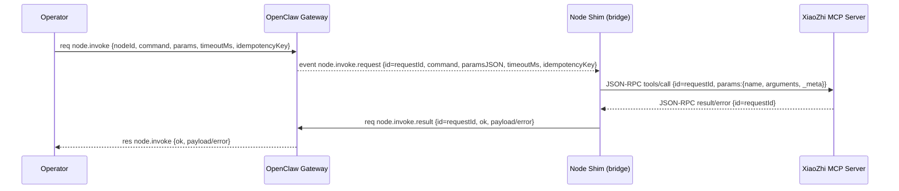

# myr2d2 总体架构（Brain=openclaw + Edge=xiaozhi + 协议桥 + MVP 垂直切片）

日期：2026-02-09  
目标：交付可运行的最小闭环（MVP），并为后续扩展成平台预留清晰边界。

## 1. 需求基线（含默认假设）

### 1.1 已知需求（来自主控提示词）
- 产品形态：桌面（其他形态待办）
- 端侧硬件：ESP32 为主（当前尚未选定具体板卡与外设）
- 关键场景：巡航 + 唤醒-对话-动作；表现类似 R2D2 / 格鲁，需要“语言”与固定指令集
- 连接方式优先级：Wi‑Fi 优先
- 安全要求：第一个版本不需要加密，需要配对审批
- 模型策略：云端大模型优先
- UI/控制面：Web 控制台

### 1.2 本轮采用的默认值（若后续指定可替换）
- Brain：OpenClaw Gateway WebSocket，默认 loopback + SSH/tailnet 远程访问（不做公网暴露）。证据：[remote.md](file:///Users/litianyi/Documents/__secondlife/__project/myr2d2/thirdparty/myopenclaw/docs/gateway/remote.md)
- Edge：优先接入 XiaoZhi MCP（JSON-RPC 2.0），数据面先用 XiaoZhi WebSocket（MQTT+UDP 作为后续升级）。证据：[mcp-protocol.md](file:///Users/litianyi/Documents/__secondlife/__project/myr2d2/thirdparty/my-xiaozhi-esp32/docs/mcp-protocol.md)、[websocket.md](file:///Users/litianyi/Documents/__secondlife/__project/myr2d2/thirdparty/my-xiaozhi-esp32/docs/websocket.md)、[mqtt-udp.md](file:///Users/litianyi/Documents/__secondlife/__project/myr2d2/thirdparty/my-xiaozhi-esp32/docs/mqtt-udp.md)
- 延迟/可靠性目标（MVP 默认）：
  - 控制指令（LAN）：P50 < 200ms，P95 < 800ms
  - 断线重连：< 3s（shim 自动重连），失败则上报 node.event
  - 音频：本轮只验收“音频流开关控制 + session_id 绑定”（音频负载可先 mock）
- 安全边界（MVP 默认）：
  - Gateway 仍采用最小暴露：loopback + SSH/tailnet
  - 必须走配对审批（device/node pairing），并使用最小权限 scopes

## 2. 总体架构（分层与边界）

### 2.1 分层
- Brain（OpenClaw）：会话/模型调用/插件/权限/审计/调度；对外暴露 Gateway WS 的 methods/events/frames。
- Edge（XiaoZhi ESP32）：通过 MCP 暴露端侧工具（tools/list、tools/call），并通过 WebSocket 或 MQTT+UDP 承载音频等数据面。
- Bridge（Node Shim，本仓库 /src 实现）：作为 OpenClaw 的一个 Node，接入 Gateway WS；下游作为 MCP Client 连接 XiaoZhi；做协议/状态机翻译。
- Connectivity（本仓库 /src 实现）：统一连接策略接口（LAN/远程/近场），决定 Gateway 与 XiaoZhi 的连接参数与降级。
- Observability（本仓库 /src 实现）：trace_id/session_id 贯穿，统一日志与事件上报。

### 2.2 组件图（Mermaid）
```mermaid
flowchart LR
  Operator[Operator: Web/CLI/WebChat] -->|Gateway WS| Gateway[OpenClaw Gateway]

  subgraph Brain
    Gateway -->|node.invoke.request event| Shim[Node Shim (bridge)]
    Shim -->|node.invoke.result| Gateway
    Shim -->|node.event| Gateway
  end

  subgraph Edge
    Shim -->|MCP JSON-RPC 2.0| XiaoZhiMCP[XiaoZhi MCP Server]
    Shim -->|Data plane WS or MQTT+UDP| XiaoZhiData[XiaoZhi Audio/AV Transport]
  end
```

## 3. 关键数据流（2 条关键时序）

### 3.1 控制流：operator → gateway → node.invoke → MCP tools/call → 回结果
OpenClaw 的 `node.invoke` / `node.invoke.request` / `node.invoke.result` 合约证据：[node-contract.md](file:///Users/litianyi/Documents/__secondlife/__project/myr2d2/doc/openclaw/nodes/node-contract.md)、[nodes.ts](file:///Users/litianyi/Documents/__secondlife/__project/myr2d2/thirdparty/myopenclaw/src/gateway/protocol/schema/nodes.ts)



### 3.2 数据流：音频流开关控制 + session_id 绑定（音频可 mock）
XiaoZhi WebSocket hello 与 listen 控制证据：[websocket.md](file:///Users/litianyi/Documents/__secondlife/__project/myr2d2/thirdparty/my-xiaozhi-esp32/docs/websocket.md)

```mermaid
sequenceDiagram
  participant O as Operator
  participant G as OpenClaw Gateway
  participant S as Node Shim (bridge)
  participant W as XiaoZhi WebSocket

  O->>G: req node.invoke {command:"edge.audio.stream.start", params:{...}}
  G-->>S: event node.invoke.request {id, command, paramsJSON}
  S->>W: JSON type=hello (or receive hello); bind session_id
  S->>W: JSON type=listen {state:"start", ...}
  W-->>S: (optional) audio binary frames / status JSON
  S->>G: req node.event {event:"edge.audio.stream.state", payload:{state:"started", session_id}}
  S->>G: req node.invoke.result {id, ok:true, payload:{session_id}}
  G-->>O: res node.invoke {ok:true, payload:{session_id}}
```

## 4. 协议桥接设计（node.invoke ↔ MCP 映射、错误/超时/重试/幂等）

### 4.1 Node Shim 形态（推荐）
将 XiaoZhi 视为 OpenClaw 的一个 Node，通过 Node Shim 把 `node.invoke.request` 翻译为 MCP 调用，并把 MCP notifications 翻译为 `node.event`。证据与推荐映射表：[xiaozhi-mapping.md](file:///Users/litianyi/Documents/__secondlife/__project/myr2d2/doc/openclaw/integration/xiaozhi-mapping.md)

### 4.2 映射表（MVP 必须覆盖）
- `node.invoke.command = "mcp.initialize"` → MCP `initialize`
- `node.invoke.command = "mcp.tools.list"` → MCP `tools/list`
- `node.invoke.command = "mcp.tools.call"` → MCP `tools/call`

MCP 合约证据：[mcp-protocol.md](file:///Users/litianyi/Documents/__secondlife/__project/myr2d2/thirdparty/my-xiaozhi-esp32/docs/mcp-protocol.md)

### 4.3 错误码、超时、重试、幂等（约定）
- 超时源：以 `node.invoke.request.timeoutMs` 为准；shim 使用同一 deadline 控制 MCP 调用与等待结果。
- 返回错误（统一格式，供 operator/agent 处理）：
  - `E_TIMEOUT`：超过 timeoutMs
  - `E_MCP_TRANSPORT`：MCP 连接/发送/接收失败
  - `E_MCP_ERROR`：MCP JSON-RPC error（透传 `code/message`）
  - `E_BAD_REQUEST`：参数不合法/缺字段
- 重试策略（MVP 默认）：
  - 不做业务级自动重试（避免不可见重复动作）
  - 仅在“发送前连接断开”触发一次透明重连再发送；要求幂等键一致
- 幂等策略：
  - OpenClaw `node.invoke` 要求 `idempotencyKey`（证据：[nodes.ts](file:///Users/litianyi/Documents/__secondlife/__project/myr2d2/thirdparty/myopenclaw/src/gateway/protocol/schema/nodes.ts)）
  - shim 内部维持“进行中请求”去重：同一 `(nodeId, idempotencyKey, command)` 在窗口内只执行一次；重复请求复用同一结果
  - shim 将 `idempotencyKey/trace_id/session_id` 作为 `_meta` 透传进 MCP params（设备端可忽略）

## 5. 连接方案对比（控制面/数据面分离优先）

### 5.1 控制面（推荐默认）
- 统一走 OpenClaw Gateway WS：loopback + SSH/tailnet；非 loopback 必须 token/password。证据：[remote.md](file:///Users/litianyi/Documents/__secondlife/__project/myr2d2/thirdparty/myopenclaw/docs/gateway/remote.md)
- Node/Device 必须配对审批（pairing），并通过 scopes/allowlist 限制能力范围。证据：[authz.md](file:///Users/litianyi/Documents/__secondlife/__project/myr2d2/doc/openclaw/security/authz.md)

### 5.2 数据面（MVP 推荐：WebSocket；升级：MQTT+UDP）
- WebSocket（MVP 默认）：实现简单、调试成本低；足以完成“音频流开关 + 会话绑定”。
- MQTT+UDP（后续）：控制与数据分离，UDP 支持 AES-CTR 加密与更低延迟；适合远程/弱网与更严格安全。证据：[mqtt-udp.md](file:///Users/litianyi/Documents/__secondlife/__project/myr2d2/thirdparty/my-xiaozhi-esp32/docs/mqtt-udp.md)
- 4G/5G（后续）：优先让 Gateway 位于稳定主机（家中/服务器），端侧通过 tailnet/VPN 或反向通道接入；数据面按网络条件选择 WebSocket 或 MQTT+UDP。
- 近场（后续）：可用蓝牙/配网（XiaoZhi 有 blufi 文档）承载初次配网与 pairing bootstrap。证据：[blufi.md](file:///Users/litianyi/Documents/__secondlife/__project/myr2d2/thirdparty/my-xiaozhi-esp32/docs/blufi.md)

### 5.3 决策清单（3 选 1）
- 方案 A：数据面 WebSocket（推荐，MVP）
  - 优点：实现/调试最快；可先 mock 音频帧
  - 缺点：弱网/远程下延迟与丢包控制能力弱于 UDP
- 方案 B：数据面 MQTT+UDP
  - 优点：控制/数据分离；UDP 天然更低延迟；具备加密方案
  - 缺点：需要 MQTT broker；状态机更复杂
- 方案 C：数据面 WebRTC（未来）
  - 优点：NAT 穿透与媒体生态成熟
  - 缺点：实现与部署复杂；不适合作为 MVP 首选

## 6. 权限模型（最小权限默认）
- Operator：通过 token/password 或 tailscale identity 接入；methods 受 role/scopes 控制。证据：[authz.md](file:///Users/litianyi/Documents/__secondlife/__project/myr2d2/doc/openclaw/security/authz.md)
- Node：通过 node pairing 获取 token；Node Shim 上报 declaredCommands，并配合 gateway allowCommands/denyCommands 做二次校验（防止越权调用）。证据：[xiaozhi-mapping.md](file:///Users/litianyi/Documents/__secondlife/__project/myr2d2/doc/openclaw/integration/xiaozhi-mapping.md)

## 7. MVP 垂直切片定义（最少功能清单 + 验收步骤）

### 7.1 最少功能清单
- 控制链路（必须跑通）
  - Node Shim 能连接 Gateway WS，并处理 `node.invoke.request`，回 `node.invoke.result`
  - 能通过 MCP 完成一次 `tools/call`（先用 mock XiaoZhi server 提供一个 tool）
- 数据链路（必须跑通）
  - 支持 `edge.audio.stream.start/stop` 两个命令
  - 具备 session_id 绑定：start 返回 session_id，且同时通过 `node.event` 上报状态

### 7.2 验收步骤（可执行）
1. 启动 OpenClaw Gateway（保持 loopback）
2. 启动 Mock XiaoZhi MCP/WebSocket server（仓库内 tests 提供）
3. 启动 Node Shim，完成 node pairing/连接（MVP 可允许预置 token）
4. 通过 OpenClaw CLI/WebChat 发起 `node.invoke`：
   - `command="mcp.tools.call"`：返回 mock status
   - `command="edge.audio.stream.start"`：返回 session_id，并收到 `edge.audio.stream.state` 事件
   - `command="edge.audio.stream.stop"`：停止并上报事件

## 8. Repo 改动清单（本轮仅涉及 /src 与 doc/plans；thirdparty 不动）
- 新增：本文件 `doc/plans/2026-02-09-myr2d2-architecture.md`
- 新增：`src/brain/`、`src/edge/`、`src/bridge/`、`src/connectivity/`、`src/observability/`、`src/tests/`
- 不改动：`thirdparty/**`

