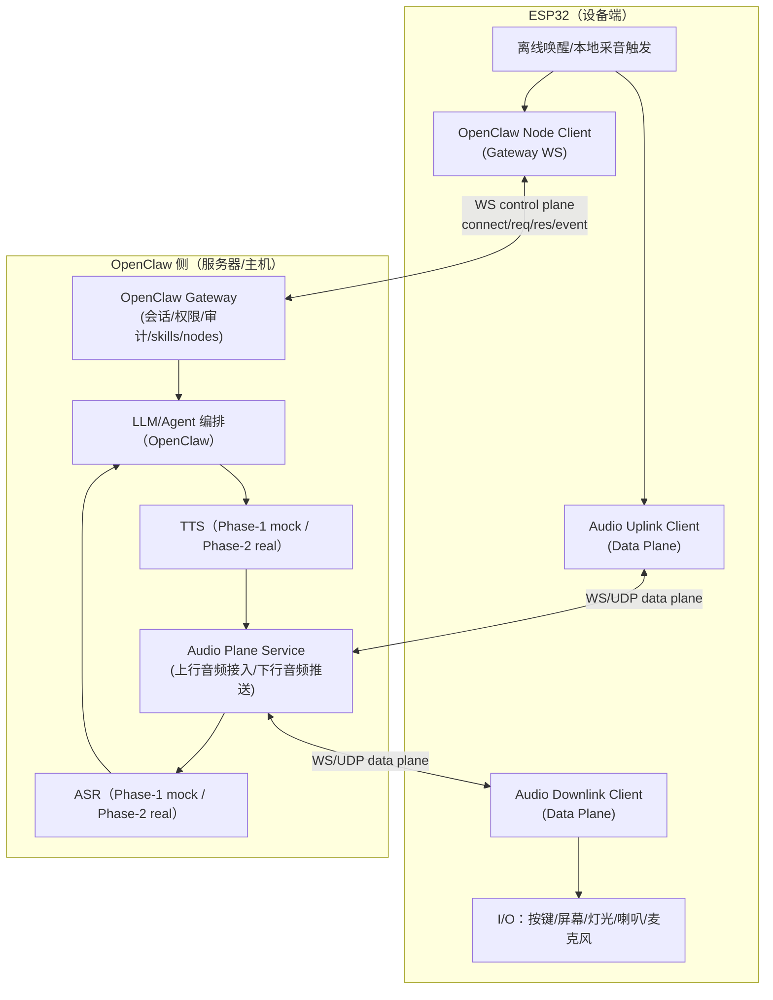

# 路线 B（一次到位）：ESP32 本地唤醒 + OpenClaw 负责其余（含分阶段 Mock）

日期：2026-02-09  
目标：直接按“最理想”路线 B 落地：**ESP32 只做唤醒与 I/O**，OpenClaw 侧负责 **会话/权限/工具编排 + ASR/LLM/TTS + 数据面服务**。  
约束：若某模块工作量较大，第一阶段允许 Mock，并在文档中明确标注。

## 0) 一句话结论
路线 B 可以做到“控制面一次到位统一到 OpenClaw”，但必须把系统拆成两张网：  
- **控制面（OpenClaw Gateway WS）**：node.connect / node.invoke / node.event  
- **数据面（Audio Plane）**：实时音频上行/下行，不建议塞进 control WS

## 1) 关键原则（避免架构掉坑）
- **唤醒在 ESP32**：ESP32 常听（本地），唤醒后再开启音频上行；避免持续上行导致功耗/带宽/弱网失败。
- **控制面不承载音频流**：`node.invoke` 适合“命令/状态”，不适合“高频大 payload 的音频帧”。
- **数据面要可演进**：Phase-1 先用简化 WS（带 token）mock；Phase-2 再替换为更稳健的数据面（可选 MQTT+UDP/QUIC/WebRTC）。
- **OpenClaw 负责能力审计与权限**：所有“工具执行/节点访问/外部系统改动”必须经过 OpenClaw（可审计、可撤销）。

## 2) 组件架构（最终形态）

## 3) 控制面协议（路线 B 必需的 node contract）

### 3.1 Node 连接（connect）
设备必须实现 OpenClaw Gateway 的帧格式：`req/res/event`，并完成 `connect` 握手（role=node + declaredCommands）。  
第一阶段使用共享 token/password；后续再升级 device identity/pairing token（更安全）。

### 3.2 最小命令集（一次到位的“正确抽象”）

建议把“唤醒”与“音频流”分开：
- `device.wake.configure`（可选）：配置唤醒词/阈值（Phase-2）
- `audio.stream.start`：要求设备启动一次会话音频上行（返回 data-plane url/token）
- `audio.stream.stop`：停止上行
- `audio.play.start`：要求设备准备播放（返回 downlink url/token）
- `audio.play.stop`：停止播放
- `device.display.render`、`device.led.set`、`device.button.subscribe`（按需逐步加）

### 3.3 关键事件（node.event）
- `voice.wake`：本地唤醒成功（含 wake_word、timestamp、confidence）
- `audio.stream.state`：started/stopped（含 session_id、codec、sample_rate）
- `audio.play.state`：started/stopped
- `device.health`：电量/温度/Wi‑Fi RSSI/heap 等（可选）

## 4) 数据面（Audio Plane）设计（Phase-1 允许 mock）

### 4.1 为什么必须有数据面
实时音频的流量与频率远超控制面承载能力，且需要背压/丢包策略/缓冲。

### 4.2 Phase-1（Mock）数据面：WebSocket 上行 + WebSocket 下行
- 上行：ESP32 连接 `wss://audio-plane/uplink?session_id=...&token=...`，持续发送二进制帧\n- 下行：ESP32 连接 `wss://audio-plane/downlink?session_id=...&token=...`，接收二进制帧\n- 音频内容：Phase-1 可不解码、不做 ASR，只统计/记录；也可用“固定 transcript mock”驱动 OpenClaw 流程

### 4.3 Phase-2（真实）数据面：Opus↔PCM + ASR/TTS 流式
需要补齐：
- Opus 解/编码（或设备改为 PCM 上行，带宽上升）\n- 流式 ASR（低延迟）\n- 流式 TTS（可先从 OpenClaw TTS provider 获取音频再切片推送）

## 5) 分阶段交付（明确 Mock）

### Phase-1：控制面一次到位 + 数据面 mock（推荐先完成）
交付：
- 设备端：OpenClaw Node Client（connect + invoke + event）\n- 服务器端：Audio Plane（uplink/downlink）骨架\n- ASR/TTS：mock（固定 transcript、固定语音片段或仅文本回传）\n- 文档：清楚标注 mock 点、替换点、接口不变

验收：
- Node 能稳定连上 Gateway\n- Gateway 能下发 `audio.stream.start/stop`，设备回 `audio.stream.state`\n- Audio Plane 能收到 uplink 数据并触发一次 mock transcript → OpenClaw → mock TTS → downlink

### Phase-2：替换 mock 为真实 ASR/TTS
交付：
- Uplink: Opus/PCM 处理 + 流式 ASR\n- Downlink: 流式 TTS（音频推送）\n- 端侧播放/缓冲策略

### Phase-3：安全与运维完善
- device identity/pairing token 生命周期\n- 指标与观测：端到端延迟、丢包、断线重连、会话成功率\n- QoS：弱网策略、码率与缓冲自适应

## 6) 本仓库落点（实现策略）
本仓库将提供：
- **ESP32 Node 的 TS 参考实现（NodeSim）**：用于验证协议与命令集，可直接迁移/对照到固件实现\n- **Audio Plane Service（Phase-1 mock）**：用于联调与接口冻结\n- **端到端测试**：使用 mock gateway 驱动 node.invoke 流程，保证协议与 contract 不回退

