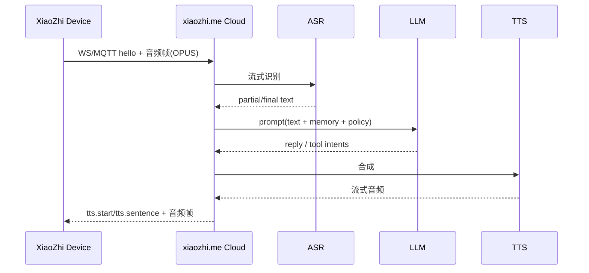
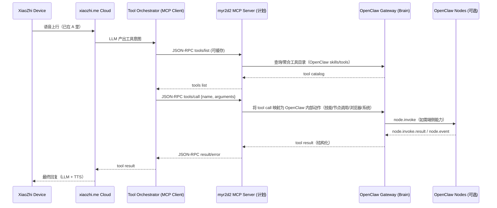

# XiaoZhi 官方默认方案下的 myr2d2 架构与数据流（含可替换模块）

日期：2026-02-09  
前提：XiaoZhi 设备端按“官方默认”连接 `xiaozhi.me` 云（设备侧负责采音/播放/唤醒；云侧负责 ASR/LLM/TTS 与 Tool Use 编排）。证据：[README_zh.md](file:///Users/litianyi/Documents/__secondlife/__project/myr2d2/thirdparty/my-xiaozhi-esp32/README_zh.md)、[websocket.md](file:///Users/litianyi/Documents/__secondlife/__project/myr2d2/thirdparty/my-xiaozhi-esp32/docs/websocket.md)、[mcp-protocol.md](file:///Users/litianyi/Documents/__secondlife/__project/myr2d2/thirdparty/my-xiaozhi-esp32/docs/mcp-protocol.md)

> 说明：本仓库当前已经实现的桥接（`/src/bridge/shim.ts`）属于“自建/直连设备”的路线（把 XiaoZhi 当成 OpenClaw 的 node 来接）。本文主图以“官方云”为中心画清楚数据架构，并标出哪些模块可替换，以及切换到当前实现/自建方案时会怎么变化。

## 1) 总览：官方默认（云为中心）的系统架构图

```mermaid
flowchart TB
  subgraph Edge["Edge: XiaoZhi 设备（ESP32）"]
    Mic["麦克风/唤醒/采集"]
    Spk["喇叭/播放"]
    FW["固件：WebSocket 或 MQTT+UDP\n(含 OPUS)"]
    Mic --> FW --> Spk
  end

  subgraph Cloud["Cloud: xiaozhi.me 官方服务（默认）"]
    WS["设备接入层\nWebSocket / MQTT"]
    ASR["ASR（流式）"]
    LLM["LLM（对话/规划）"]
    TTS["TTS（流式）"]
    Orchestrator["Tool Orchestrator\n(MCP Client)"]
    WS --> ASR --> LLM --> TTS --> WS
    LLM --> Orchestrator
  end

  subgraph Brain["Brain: myr2d2（建议）= OpenClaw Gateway"]
    Gateway["OpenClaw Gateway WS\n(会话/权限/审计/技能)"]
    Nodes["Nodes（可选）\nmacOS/iOS/Android/Headless\n通过 node.invoke 接入"]
    Gateway <-->|node.invoke / node.event| Nodes
  end

  subgraph Adapter["Adapter: myr2d2 MCP 适配层（计划实现）"]
    McpServer["MCP Server（对云暴露 Tools）\nJSON-RPC 2.0"]
    McpServer <--> Gateway
  end

  Edge <-->|音频(二进制OPUS)+控制(JSON)| Cloud
  Orchestrator <-->|tools/list tools/call| McpServer
```

### 简介（你可以直观理解为两条主链路）
- **主对话链路（语音）**：设备采音 → 上云 → 云 ASR/LLM/TTS → 下发 TTS/状态 → 设备播放。
- **工具链路（能力扩展）**：云端 LLM 触发 Tool Use → 通过 MCP 调用 myr2d2（OpenClaw）暴露的工具 → 返回结果 → 云继续生成回复/动作。

## 2) 数据流向图 A：语音对话（官方默认）



你现在可调整的点（不改设备固件前提下）主要在云侧：模型选择、对话策略、是否触发工具、工具结果如何融入回复。

## 3) 数据流向图 B：工具调用（官方默认 + myr2d2 接管工具能力）



这里的关键点是：**把“工具能力”从 XiaoZhi 官方云的默认扩展点（MCP）接管到 OpenClaw**，使得你后续要接入桌面自动化、浏览器、IoT、摄像头等能力时，不用改 XiaoZhi 固件，主要在 Brain/Nodes 侧扩展。

## 4) 与当前已实现代码的关系（直连设备 vs 官方云）

### 4.1 当前已实现（自建/直连设备）路线：XiaoZhi 作为 OpenClaw 的 Node
- 已实现：`/src/bridge/shim.ts` 作为 OpenClaw node 连接 Gateway，并把 `node.invoke.request` 翻译为 XiaoZhi WS 上的 MCP `tools/call` 与 `listen start/stop`。\n  代码入口：[shim.ts](file:///Users/litianyi/Documents/__secondlife/__project/myr2d2/src/bridge/shim.ts)、[xiaozhi-ws-transport.ts](file:///Users/litianyi/Documents/__secondlife/__project/myr2d2/src/bridge/xiaozhi-ws-transport.ts)
- 适用场景：你**自建 XiaoZhi server** 或设备允许连接到你的 WS/MQTT endpoint；你希望 OpenClaw 直接编排设备（控制面单一）。

### 4.2 官方默认（云为中心）路线：OpenClaw 作为云侧 MCP Server
- 计划实现：一个 `mcp-server-adapter`（对 xiaozhi.me 暴露 Tools，内部转 OpenClaw Gateway）。\n  这与当前 shim 相反：\n  - 当前：OpenClaw →（node.invoke）→ XiaoZhi\n  - 官方默认：XiaoZhi 云 →（MCP tools/call）→ OpenClaw
- 适用场景：你希望设备完全按官方方式跑通语音体验（ASR/LLM/TTS 由官方提供），而你在云侧“挂载”自己的工具能力。

## 5) 可调整/可替换模块清单（以及替换方案）

### 5.1 数据面传输（设备 ↔ 云）
- 默认：WebSocket（开发/调试最简单；见 [websocket.md](file:///Users/litianyi/Documents/__secondlife/__project/myr2d2/thirdparty/my-xiaozhi-esp32/docs/websocket.md)）
- 可替换：MQTT+UDP（弱网/低延迟/加密；需要 MQTT broker；见 [mqtt-udp.md](file:///Users/litianyi/Documents/__secondlife/__project/myr2d2/thirdparty/my-xiaozhi-esp32/docs/mqtt-udp.md)）
- 取舍：WebSocket 省事；MQTT+UDP 更强但运维/状态机更复杂。

### 5.2 语音栈（ASR/LLM/TTS）
- 默认：官方云（最省事，但依赖第三方服务策略/配额）
- 可替换方案：\n  - 自建 XiaoZhi server（把 ASR/LLM/TTS 移到你控制的服务器）\n  - 未来可拆：ASR/TTS 可分别替换成你的供应商或本地部署（代价是运维与成本）

### 5.3 工具系统（Tool Use）
- 默认：官方云作为 MCP Client，调用外部 MCP Server（你要做的是“提供一个 MCP Server”）
- 可替换方案：\n  - 让 OpenClaw 做 Brain：把工具执行与权限审计集中在 OpenClaw（推荐）\n  - 继续用官方云的工具生态：你只做少量自定义 tool（更快但可控性弱）

### 5.4 Brain（决策/会话/权限/审计）
- 默认建议：OpenClaw Gateway（本仓库方向）
- 可替换：你自己的 orchestrator（但会失去 OpenClaw 的 nodes/skills/安全模型与生态）

### 5.5 Bridge/Adapter（协议适配层）
- 现有：OpenClaw Node Shim（直连设备路线）
- 计划：MCP Server Adapter（官方默认路线）
- 可替换：把 bridge 合并进 OpenClaw 的 node 或 channel 插件（更紧耦合，但减少一层进程）

## 6) 你接下来怎么用这张图做决策（最短路径）
- 如果你 **优先要“马上能说能用”**：走官方默认（设备连 xiaozhi.me），优先补齐 “myr2d2 MCP Server Adapter”，让 OpenClaw 以 Tools 形式接管动作能力。
- 如果你 **优先要“完全可控/可离线/可审计”**：走自建（设备连自建 server），沿用当前已实现的 Node Shim，把设备当 OpenClaw node 管。

