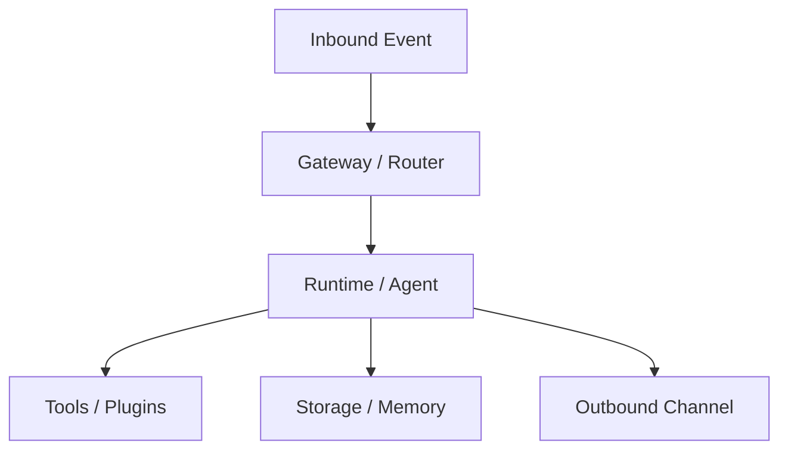

# Dataflow Baseline: thirdparty/myopenclaw

- Commit ID: `5dd304d1c65952646b2544132bb9948e5adc57c5`
- Commit short: `5dd304d1c`
- Feature profile: context-management, state-machine, tool-strategy, fallback-retry, memory-system, hooks-plugins

## 1. Data Entities

- [ ] List key request/response entities
- [ ] List persisted entities and storage location
- [ ] List transient entities in memory only

## 2. End-to-End Flow Table

| Step | Input | Processing component | Output | Persistence side effect |
|---|---|---|---|---|
| 1 | TODO | TODO | TODO | TODO |
| 2 | TODO | TODO | TODO | TODO |

## 3. Dataflow Diagram (Mermaid)

## 4. Data Integrity and Privacy Checks

- [ ] Document validation boundaries
- [ ] Document redaction / sensitive-field handling
- [ ] Document idempotency and dedupe strategy
