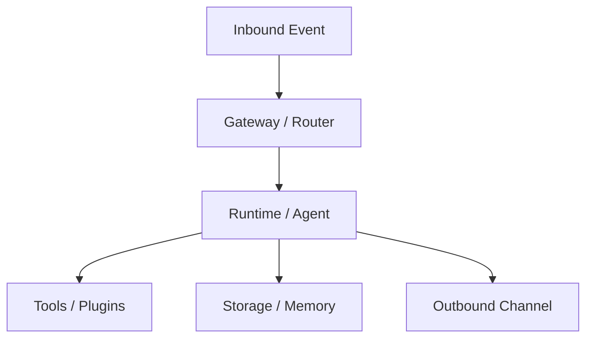

# Dataflow Baseline: thirdparty/myopenclaw

- Commit ID: `5dd304d1c65952646b2544132bb9948e5adc57c5`
- Commit short: `5dd304d1c`
- Analysis depth: `deep`
- Feature profile: context-management, state-machine, tool-strategy, fallback-retry, memory-system, hooks-plugins

## 1. Data Entities (deep auto-fill; verify manually)

- Inbound event/request payload from channel or API transport.
- Runtime context/session envelope for routing and conversation continuity.
- Tool/plugin invocation request/response payloads.
- Persisted state surfaces: `src/sessions`, `src/memory`, `src/config`.
- Outbound response payload emitted to transport/channel layer.

## 2. End-to-End Flow Table (seed)

| Step | Input | Processing component | Output | Persistence side effect |
|---|---|---|---|---|
| 1 | Inbound event/request | Gateway/router transport layer | Normalized runtime request | Session lookup/update |
| 2 | Normalized runtime request | Agent/runtime orchestration | Tool/plugin calls + model output | Memory/session write |
| 3 | Runtime result | Gateway/channel adapter | Outbound message/event | Delivery log/trace |

## 3. Dataflow Diagram (Mermaid)

## 4. Data Integrity and Privacy Checks

- [ ] Validate schema at transport boundary before entering runtime.
- [ ] Redact sensitive fields before logs/traces/storage writes.
- [ ] Enforce idempotency and dedupe around retries/replays.

