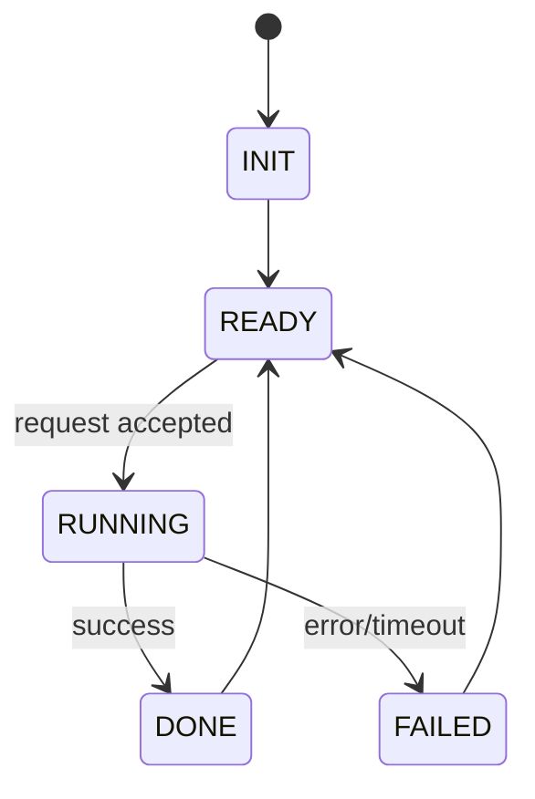

# State Machine Baseline: thirdparty/myopenclaw

- Commit ID: `5dd304d1c65952646b2544132bb9948e5adc57c5`
- Commit short: `5dd304d1c`
- Analysis depth: `deep`
- Feature profile: context-management, state-machine, tool-strategy, fallback-retry, memory-system, hooks-plugins

## 1. Core States (deep auto-fill; verify manually)

- INIT: process/bootstrap and dependency initialization.
- READY: runtime initialized and waiting for requests/events.
- RUNNING: active request execution and orchestration.
- DONE: successful completion path before returning to READY.
- FAILED: error/timeout path with fallback or retry handling.

## 2. Transition Table (seed)

| From | Trigger/Event | To | Guard | Timeout/Error path |
|---|---|---|---|---|
| INIT | startup complete | READY | config/schema valid | FAILED |
| READY | request accepted | RUNNING | auth/routing passed | FAILED |
| RUNNING | result produced | DONE | execution success | FAILED |
| RUNNING | timeout/error | FAILED | retry budget exhausted | READY |
| DONE | dispatch complete | READY | none | FAILED |
| FAILED | fallback/retry complete | READY | recovery success | FAILED |

## 3. State Diagram (Mermaid)

## 4. Operational Guarantees

- [ ] Define retry budget/backoff/idempotency by transition.
- [ ] Define concurrency controls and locking scope.
- [ ] Define crash-recovery rules and replay safety checks.

