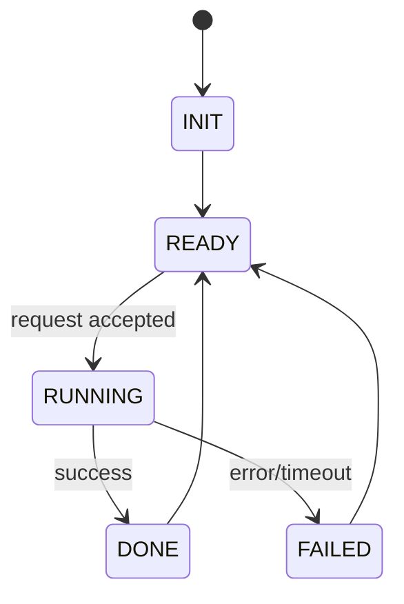

# State Machine Baseline: thirdparty/myopenclaw

- Commit ID: `5dd304d1c65952646b2544132bb9948e5adc57c5`
- Commit short: `5dd304d1c`
- Feature profile: context-management, state-machine, tool-strategy, fallback-retry, memory-system, hooks-plugins

## 1. Core States

- [ ] Enumerate runtime states
- [ ] Mark terminal states
- [ ] Mark error states

## 2. Transition Table

| From | Trigger/Event | To | Guard | Timeout/Error path |
|---|---|---|---|---|
| TODO | TODO | TODO | TODO | TODO |

## 3. State Diagram (Mermaid)

## 4. Operational Guarantees

- [ ] Retry semantics by state
- [ ] Concurrency/locking semantics
- [ ] Recovery semantics after crash/restart
